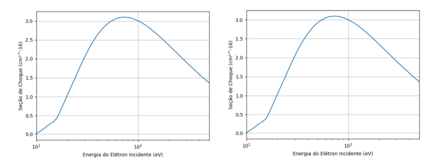
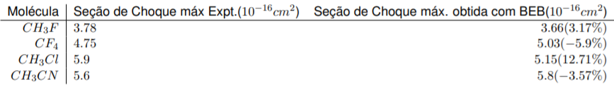
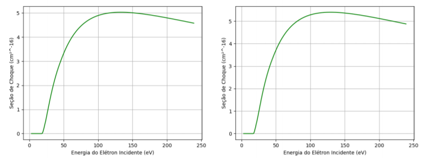
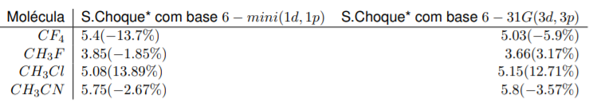
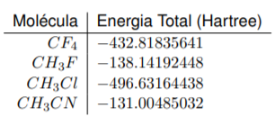

# BEB
## *Abstract*
  This code is the implementation of BEB (Binary-Encounter-Bethe) Cross Section in Python (3.x), developed for an Undergraduate Research Project at UFPR (Federal University of Parana) in Brazil. 

## *Resumo*
  Este repositório contém a implementação do calculo da Seção de Choque de Ionização pelo Método de BEB (Binary-Encounter-Bethe). Feito no meu projeto de Iniciação Cienficia no Grupo de Física Atomica e Molecular(GFAM).
  
## Estrutura deste Repositório

0. Por que este repositório foi feito?
1. O que é o BEB?
2. Como utlizar o programa?
3. Como realizar e plotar seções de choque em massa?
4. Agradecimentos

### 0. Por que este repositório foi feito?

  Este repositório foi desenvolvido no âmbito do meu Plano de Trabalho de iniciação cientifica no Grupo de Física Atomica e Molecular (GFAM), na UFPR. Fiz parte do projeto na modalidade PIBIC-AF, como aluno bolsista. O objetivo principal desse plano de trabalho era a implementação computacional do calculo das Seções de Choque de Ionização utilizando o método de BEB, que será melhor descrito ao longo desse Readme.
  A partir das necessidades da industria brasileira e internacional, o estudo de tratamentos de materiais
com implatação de íons vem se tornando cada vez mais necessario. Para entender a natureza desses tratamentos, recorremos ao entendimento da complexa Seção de Choque de Ionização, para este
calculo, no entanto, pode ser necessario diversos parametros experimentais. O Método de BEB, por
sua vez, substituí a dependencia experimental, alienando o resultado ao calculo da estrutura eletronica
para softwares como o GAMESS. Ao implementar em python o método de BEB e obter os resultados,
observamos que esse método é altamente preciso mediante a escolha correta da base utilizada para
o calculo da estrutura eletronica.
### 1. O que é o BEB?
Apesar dos avanços em Mecânica Quântica, o calculo das seções de choque de ionização muitas
vezes é subordinado a parametros experimentais que não são necessariamente viaveis de se adquirir
ou mensurar. Para contornar esse problema, podemos nos utilizar do calculo dessas seções de choque
através do Método de BEB(BINARY-ENCOUNTER-BETHE), nesse calculo utilizamos apenas os resultados advindos de softwares de calculo de estrutura eletronica, como o GAMESS. Basicamente, a seção de choque de ionização é, para os efeitos do método de BEB, a área sobre uma molécula, que mede a chance de colisão de um elétron da molécula com um elétron disparado contra ela, sendo que o processo resulta na ionização da molécula e consequente retirada do elétron.

A Equação de BEB é, portanto

A implementação do BEB deste plano de trabalho gerou resultados muito satisfatórios em relação aos dados experimentais e aos dados ja presentes na literatura. Ao comparar os resultados obtidos por esta implementação do BEB com os dados obtidos pelo NIST, temos o gráfico abaixo:
<figure>
  
  <figcaption><i>À esquerda os dados advindos do NIST e implementação do NIST. À direita com os dados e calculos obtidos por mim e com minha implementação do BEB.</i></figcaption>
</figure>

  Podemos observar que a concordancia é realmente boa. Está concordancia se repete ao longo de várias moléculas comparadas com a base de dados do NIST, no entanto, esta versão do BEB funciona apenas para os casos sem dupla ionização.
  Em relação aos dados experimentais o BEB se mostra bem preciso, como podemos ver(entre parenteses há a diferença percentual entre a seção de choque máxima obtida pelo método de BEB em relação ao resultado experimental):
 

No entanto a boa escolha da base influencia os resultados experimentais, como podemos ver:
<figure>
  
  <figcaption><i>: A figura da esquerda é o calculo da seção de choque pelo método de
BEB utilizando dados provenientes do GAMESS com a Base 6 − 31G(3d, 3p); A figura da direita, representa a seção de choque com dados provenientes do GAMESS e configuração de base 6−mini(1d, 1p)</i></figcaption>
</figure>

A base 6− 31G(3d, 3p) apresenta resultado melhor com erro em relação aos valores experimentais de -5.9%, enquanto a outra base apresentou erro de -13.7%. No entanto, esta diferença nem sempre se repete, e a menor energia nem sempre resulta numa melhor descrição.

Para algumas moléculas temos uma tabela que mostra o valor da seção de choque para duas bases diferentes, entre parenteses as diferenças percentuais desses valores em relação aos dados experimentais:

Para a base  6− 31G(3d, 3p):

Para a base  6− mini(1d, 1p):

Como podemos observar, a base 6− 31G(3d, 3p) ofereceu sempre melhor descrição com menor energia, porém nem sempre a seção de choque obtida utilizando os dados dela teve o menor erro em relação a experimental. 
